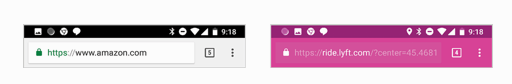
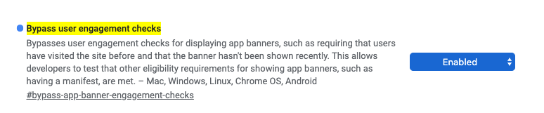
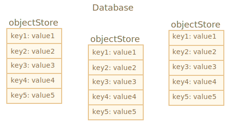

# Progressive Web Applications

---

# PWA

> Progressive Web Apps (PWA) are web applications built and enhanced with modern APIs to deliver native-like capabilities, reliability, and installability while reaching _anyone, anywhere, on any device_ with a single codebase.

---

# Famous PWAs

- [Twitter](https://twitter.com/home)
- [Starbucks](https://app.starbucks.com/) (x2 active users and on desktop)
- Flipboard
- [Pinterest](https://www.pinterest.it/)
- Instagram (only on Windows)
  - Developing countries with camera filters and offline support

--- 

# Web Applications

- Immersive experience
- Speed and fluidity
- Polish and personality

---

[.background-color: #FFFFFF]


---

- Introduced in 2015
- 3 main pillars
  1. Capable
  2. Reliable
  3. Installable

---

# 1. Capable

- WebRTC, Geolocation, Push Notifications
- WebAssembly
- Filesystem, Camera API etc.

- Secure, permission model

---

# 2. Reliable

- Speed is essential
- Work regardless of network connection

^ Bouncing rate
- Tickets available offline

---

# 3. Installable

- Launchable
- Handle links from other applications
- Default application for filetype

---

# Key features

1. Responsive
2. Connectivity-independent
3. Feel like a native app
4. Always up-to-date
5. Safe (HTTPS)
6. Discoverable
7. Linkable
8. Installable
9. Re-engageable

---

# PWAs vs native apps

- Better experience on the website itself
- Increase chance of downloading the native app
- [People are installing less applications](https://www.comscore.com/Insights/Presentations-and-Whitepapers/2017/The-2017-US-Mobile-App-Report)
- Native capabilities

---

# Pro

- Lightweight compared to native apps
- More accessible via web URL
- No app/store or gatekeeper
- Updates OTA

^ Already available when you open the website
No insufficient storage space

---

# First movers

- Developing markets
  - Limited storage
  - Slow and unstable connection

---

# Use cases - Twitter

- + 65% pages per session
- + 75% tweets
- - 20% bounce rate
- - 97% size

---

# Use cases - Pinterest


- [PWA Stats](https://www.pwastats.com/)

---

# Compared to other web solutions

PhoneGap
Electron
React Native

- Unibiquity
- Linkability

---

# Progressive enhancement

Create a baseline that works everywhere. Then enhance the experience on more capable devices.

^ Benefits even for old browser users
AliExpress

---

# Writing our first PWA

---

# Technically

1. HTTPS
   - Required however for APIs like Geolocation, Payment
2. Service worker
3. A manifest
  - [app-manifest.firebaseapp.com/](https://app-manifest.firebaseapp.com/)

---

# HTTPS

- Safety
- APIs like Request Payment, Geolocation
- Bult-in in GH Pages, Cloudflare, Netlify etc.


---

# background_color


---

# background_color


---

# theme_color



---

[.background-color: #FFFFFF]


---


# display-mode

- browser
- minimal-ui
- standalone (!)
  - URL address bar
  - Share options
- fullscreen (!!)
  - Navigation bar

---

# Service worker

---


---

```js

if ('serviceWorker' in navigator) {
  const swUrl = `/sw.js`;

  window.addEventListener('load', () => {
    navigator.serviceWorker
      .register(swUrl)
      .then(registration => {
        console.log('[ServiceWorker] registered', registration);

        registration.addEventListener('updatefound', () => {
          console.log('[ServiceWorker] update found');
        });
      })
      .catch(err => console.log('[ServiceWorker] registration failed: ', err));
  });
}
```

---

# SW registration scope


---

```js
self.addEventListener('install', () => {
  console.log('install');
});

self.addEventListener('activate', () => {
  console.log('activate');
});
```

---

# Service Worker limitations

- No access to DOM
- Similar to `WebWorker`
- Must live on the same domain


^ No DOM: parallelism and sometimes b/c no document

---

# SW lifecycle


^ Update - Waiting
^ Similar to how the browser updates

---

# Intercepting fetch

```js
self.addEventListener('fetch', event => {
  const request = event.request;

  event.respondWith(new Response('Hello world'));
});
```

---


---

# Add static files to cache

```js
const CACHE_NAME = 'daisyhub-cache';

self.addEventListener('install', event => {
  console.log('install');
  event.waitUntil(
    caches.open(CACHE_NAME).then(cache => {
      return cache.addAll(['/static/media/image.png']);
    }),
  );
});
```

---

# Cache handling

> *There are only two hard things in Computer Science: cache invalidation and naming things.*

> -- Phil Karlton

---

# Cache falling back to network

```js
self.addEventListener('fetch', event => {
  const request = event.request;

  if (request.method !== 'GET') return;

  event.respondWith(
    caches.match(request).then(response => {
      return response || fetch(request);
    }),
  );
});
```

---

# Service worker wait


^ Similar to Chrome updates

---

# Avoid waiting for clients to close

```js
self.skipWaiting();
self.clients.claim()
```

---

```js
navigator.serviceWorker.register('/sw.js').then(reg => {
  reg.installing; // the installing worker, or undefined
  reg.waiting; // the waiting worker, or undefined
  reg.active; // the active worker, or undefined

  reg.addEventListener('updatefound', () => {
    const newWorker = reg.installing;

    newWorker.state;
    // "installing" - the install event has fired, but not yet complete
    // "installed"  - install complete
    // "activating" - the activate event has fired, but not yet complete
    // "activated"  - fully active
    // "redundant"  - discarded. Either failed install, or it's been
    //                replaced by a newer version

    newWorker.addEventListener('statechange', () => {
      // newWorker.state has changed
    });
  });
});

navigator.serviceWorker.addEventListener('controllerchange', () => {
  // A new worker has become the new active worker.
});
```

---

# Delete old cache

```js
self.addEventListener('activate', event => {
  event.waitUntil(
    caches.keys().then(keyList => {
      return Promise.all(
        keyList.map(cacheKey => {
          if (cacheKey !== CACHE_NAME) return caches.delete(cacheKey);

          return Promise.resolve(null);
        }),
      );
    }),
  );
});
```

---

# Network with generic fallback

```js
const urlsToCache = ['/offline.html'];

self.addEventListener('fetch', event => {
  const request = event.request;
  const url = new URL(request.url);

  if (url.pathname === '/') {
    return event.respondWith(
      fetch(request).catch(error => {
        return caches.match('/offline.html');
      }),
    );
  }
});
```

---

# Cache on network response

```js
const request = event.request;
const accept = request.headers.get('Accept');

if (accept.includes('image')) {
  return event.respondWith(
    caches.match(request).then(response => {
      if (response) return response;

      return caches.open(CACHE_NAME).then(cache => {
        return fetch(request).then(response => {
          cache.put(request, response.clone());

          return response;
        });
      });
    }),
  );
}
```

^ Immagini di articoli

---

# Stale-while-revalidate

```js
const imagesRegxp = /(\.(png|jpeg|svg|ico))$/;
if (imagesRegxp.test(request.url)) {
  return event.respondWith(
    caches.match(request).then(response => {
      if (response) {
        event.waitUntil(
          caches.open(CACHE_NAME).then(cache => {
            return fetch(request).then(response => {
              return cache.put(request, response.clone());
            });
          }),
        );

        return response;
      }

      return caches.open(CACHE_NAME).then(cache => {
        return fetch(request).then(response => {
          cache.put(request, response.clone());

          return response;
        });
      });
    }),
  );
}
```

---

# Stale-while-revalidate

```js
function staleWhileRevalidate(cacheName, request) {
  return caches.open(cacheName).then((cache) => {
    return cache.match(request).then((response) => {
      const fetchRequest = fetch(request).then((fetchResponse) => {
        cache.put(request, fetchResponse.clone());

        return fetchResponse;
      });

      return response || fetchRequest;
    });
  });
}
```

---

```js
const CACHE_STATIC = 'daisyhub-static-v1';
const CACHE_IMAGES = 'daisyhub-images-v1';
const CACHE_NAMES = [CACHE_STATIC, CACHE_IMAGES];

const staticUrlsToCache = ['/offline.html'];
```

---

# Network falling back to the cache

```js
const CACHE_PAGES = 'daisyhub-pages-v1'
const CACHE_NAMES = [CACHE_STATIC, CACHE_IMAGES, CACHE_PAGES];

const isHome = url.pathname === "/";
if (isHome) {
  return event.respondWith(
    caches.open(CACHE_PAGES).then((cache) => {
      return fetch(request)
        .then((response) => {
          event.waitUntil(cache.put(request, response.clone()));

          return response;
        })
        .catch(() => {
          return cache
            .match(request)
            .then((response) => response || caches.match("/offline.html"));
        });
    })
  );
}
```

^ Con: waits for fetch before response, problem for slow connection

---

# networkFallbackCache

```js
function networkFallbackCache(cacheName, request) {
  return caches.open(cacheName).then((cache) => {
    return fetch(request)
      .then((response) => {
        cache.put(request, response.clone());

        return response;
      })
      .catch((error) => {
        console.log("Failed to fetch", request.url, error);

        return cache.match(request).then((response) => {
          if (!response) return Promise.reject(null);

          return response;
        });
      });
  });
}
```

---

# Other HTML pages: Stale-while-revalidate

```js
const isHTML = request.mode === 'navigate'

if (isHTML) {
  return event.respondWith(
    staleWhileRevalidate(CACHE_PAGES, request).catch((error) => {
      console.log("Failed to fetch", request.url, error);
      return caches.match("/offline.html");
    })
  );
}
```

---

# The building blocks of Caching

1. Filter the request 
2. Look for the file in the cache
3. Fetch from the network
4. Put copies into the cache

---

# More caching strategies

---

# Cache-only

```js
self.addEventListener('fetch', (event) => {
  event.respondWith(caches.match(event.request));
});
```

- Good for files in cache at install

---

# Network-only

```js
self.addEventListener('fetch', (event) => {
  event.respondWith(fetch(event.request));
});
```

- For not GET requests, analytics etc.

---

# Cache then network

In the UI:

```js
const networkDataReceived = false;

const fetchRequest = fetch('/data.json')
  .then((response) => response.json())
  .then((data) => {
    networkDataReceived = true;
    updatePage(data);
  });

caches.match('/data.json')
  .then((response) => response.json()).then((data) => {
    if (!networkDataReceived) updatePage(data)
  })
```

^ In the SW, responses are saved in cache

---

# Cache then network

In the Service Worker:

```js
self.addEventListener('fetch', (event) => {
  event.respondWith(
    caches.open(CACHE_DATA).then((cache)  =>{
      return fetch(event.request).then((response) => {
        cache.put(event.request, response.clone());

        return response;
      });
    })
  );
});
```

---

# Quiz time

---

# [forms.gle/MgvVxE51zYm6aipZ6](https://forms.gle/MgvVxE51zYm6aipZ6)

---

# Cleaning the cache

```js
navigator.storage.estimate().then(({usage, quota}) => {
  console.log(`Using ${usage} out of ${quota} bytes.`);
});
```

```js
function trimCache(cacheName, limit) {
  return caches.open(cacheName).then((cache) => {
    return cache.keys().then((requests) => {
      return Promise.all(
        requests.slice(0, limit).map((request) => cache.delete(request))
      );
    });
  });
}
```

---

# Cleaning the cache

```js
if (navigator.serviceWorker.controller) {
  navigator.serviceWorker.controller.postMessage({
    type: "TRIM_CACHE",
  });
}
```

```js
self.addEventListener("message", (message) => {
  const data = message.data;

  switch (data.type) {
    case "TRIM_CACHE":
      trimCache(CACHE_IMAGES, 50);
      break;
    default:
      break;
  }
});
```

---

# Save for offline

```js
const url = window.location.href;

button.addEventListener('click', () => {
  caches.open(CACHE_PAGES).then((cache) => cache.add(url));
})
```

---

# Save for offline

```js
const url = window.location.href;
const saved = JSON.parse(localStorage.getItem(STORAGE_KEY)) || [];

caches.open(CACHE_PAGES).then((cache) => {
  cache.add(url).then(() => {
    const metadata = {
      url: url,
      title: document.querySelector(".article__title").textContent.trim(),
      subtitle: document
        .querySelector(".article__subtitle")
        .textContent.trim(),
    };

    localStorage.setItem(STORAGE_KEY, JSON.stringify([...saved, metadata]));
  });
});
```

---

```js
const list = document.querySelector(".offline-articles");

caches.open(CACHE_PAGES).then((cache) => {
  cache.keys().then((requests) => {
    requests.forEach((request) => {
      const metadata = saved.find((x) => x.url === request.url);

      if (!metadata) return;

      const listItem = document.createElement("li");
        listItem.innerHTML = `
        <h3><a href="${metadata.url}">${metadata.title}</a></h3>
        <p>${metadata.subtitle}</p>
      `;

      list.appendChild(listItem);
    });
  });
});
```

---

[.background-color: #FFFFFF]


---

# Adding to the cache safely

```js
event.waitUntil(
  caches.open(CACHE_STATIC).then((cache) => {
    return Promise.all(
      staticUrlsToCache.map((url) =>
        cache.add(url).catch((error) => {
          console.log("Failed to add", url, "to the cache", error);
        })
      )
    );
  })
);
```

---

# Debugging Service Workers

- [chrome://inspect/#service-workers](chrome://inspect/#service-workers)
- [chrome://serviceworker-internals](chrome://serviceworker-internals)
- Devtools console
- Devtools source breakpoints

---

# Auditing - Lighthouse

- [web.dev/measure/](https://web.dev/measure/)

---


---

# Installing is not the goal

- Most people don't install the application or reuse it
- PWA is enabled even if not installed

---

# Choosing the right moment

- Not deterministic 
- Save and reuse `beforeinstallprompt` event

---

# Google Chrome criteria

1. Meets user engagement **heuristic**
2. Manifest with
   1. `name/short_name`
   2. `icons` (at least 192x192)
   3. `start_url`
   4. `display: 'fullscreen' | 'standalone' | 'minimal-ui'`
3. Service worker with `fetch` handler

---

# Save the prompt

```js
let deferredPrompt;

window.addEventListener('beforeinstallprompt', (e) => {
  e.preventDefault(); // Hides banner
  deferredPrompt = e;
  console.log('Saved install prompt for later');
  showInstallPromotion();
});
```

^ Replace console with log service

---

# Use the prompt event

```js
buttonInstall.addEventListener('click', (e) => {
  hideMyInstallPromotion();
  deferredPrompt.prompt();
  deferredPrompt.userChoice.then((choiceResult) => {
    if (choiceResult.outcome === 'accepted') {
      console.log('User accepted the install prompt');
    } else {
      console.log('User dismissed the install prompt');
    }
  })
});
```

---

# Trigger install prompt event

- [chrome://flags/#bypass-app-banner-engagement-checks](chrome://flags/#bypass-app-banner-engagement-checks)
- Lighthouse Audit for PWA

---

[.background-color: #FFFFFF]



---

```js
window.addEventListener('appinstalled', (event) => {
  console.log('The app is installed');
});
```

---

```css
@media (display-mode: fullscreen) { /* Safari 13 */
  .back-btn {
    display: inline;
  }
}
```

```js
window.addEventListener('load', () => {
  if (matchMedia('(display-mode: fullscreen)').matches) {
    console.log('The app is installed');
  } else {
    console.log('The app is in the browser');
  }
});
```

---

# App Stores

- Microsoft Store
- Google Play Store via [Trusted Web Activity](https://developers.google.com/web/android/trusted-web-activity)
- ~~Apple App Store~~

Be aware of stricter standards.

---

# Design

- Native UI
  - Difficult
  - Must be uncanny
  - Loose of brand
- Page transitions
- Immersive

---

# App Shell

- The shell is the set of UI wrapping the content
- [Progressive Web Apps with React](https://medium.com/@addyosmani/progressive-web-apps-with-react-js-part-2-page-load-performance-33b932d97cf2)
- Benefits even for not PWAs (*Washington Post*)

---

[.background-color: #FFFFFF]


---


---

# Single Page Applications

- One .html per page


---

# Single Page Applications

- Only one .html forever


---

# PRPL Pattern

- Preload (Push)
  - `<link rel="preload" as="style" href="css/main.css">`
- Render
  - Critical CSS, SSR, Route splitting
- Pre-cache
- Lazy

---

# App Shell is optional

- You can have PWA in CMS like Drupal w/o shell
- [Turbolink](https://github.com/turbolinks/turbolinks)

---

# Offline support

---

- Trip details
- Music/podcast playing
- Recent content in socials

---

- Provide a offline notification
  - `navigator.onLine` / `BackgroundSync`

---


---

# Saving offline changes

- Use `localStorage/sessionStorage` or `IndexedDB`
- `BackgroundSync`
- Inform the user of the network status


^ Disable changes

---

# Push Notifications

---

People don't like notifications.

- Supported in Chrome, Firefox, Opera
  - [caniuse.com/#feat=push-api](https://caniuse.com/#feat=push-api)
  - No in iOS and everywhere with quirks

---

# Best practises

- Personalise by user interest
- Choose the right time to ask permission
  - 90% of users ignore the request
- Design your notifications

---

[.background-color: #FFFFFF]


---

[.background-color: #FFFFFF]


---

[.background-color: #FFFFFF]


---

# 3 phases

1. Client requests Subscription
2. Server sends Push Message
3. Client shows Notification on device

---

[.background-color: #FFFFFF]


---

# 1. Client requests Subscription


---

# 2. Server sends Push Message


---

# 3. Client shows Notification on device


---

```js
const supportNotifications = 'Notification' in window;

if (supportNotifications || Notification.permission !== 'default') {
  button.style.display = 'none';
}

button.addEventListener('click', () => {
  Notification.requestPermission().then(permission => {
    if (permission !== 'granted') return;

    new Notification('Hei there');
  });
})
```

- Can request only after user event
- User can block requests on mobile

^ Removing denied permission is troublesome

---


---

- [tools.reactpwa.com/vapid](https://tools.reactpwa.com/vapid)
- [web-push generate-valid-keys](https://github.com/web-push-libs/web-push#command-line)

---

```js
function subscribeToPush() {
  return navigator.serviceWorker.ready
    .then(registration => {
      if (!registration.pushManager) return;

      const vapidPublicKey = 'BNNQBC2bIR1I6S0yBoUK6-bgKpa...';

      return registration.pushManager.subscribe({
        userVisibleOnly: true,
        applicationServerKey: urlBase64ToUint8Array(vapidPublicKey),
      });
    })
    .then(pushSubscription => {
      console.log(JSON.parse(JSON.stringify(pushSubscription)));
      return pushSubscription;
    });
}
```

---

# PushSubscription JSON

```js
{
  "endpoint": "https://fcm.googleapis.com/fcm/send/f1f9wU5uWf0:APA91bF4l...",
  "expirationTime": null,
  "keys": {
    "p256dh": "BKsjzTMuVXeuDx7Ac2ccEXuMlAzIP...",
    "auth": "ugNjT6RtpDd..."
  }
}
```

---

```js
function subscribeToPush() {
  return navigator.serviceWorker.ready.then(registration => {
    if (!registration.pushManager) return;

    const vapidPublicKey = 'BNNQBC2bIR1I6S0yBoUK6-bgKpa...';

    return registration.pushManager.subscribe({
      userVisibleOnly: true,
      applicationServerKey: urlBase64ToUint8Array(vapidPublicKey),
    });
  });
}

function requestNotifications() {
  return Notification.requestPermission().then(permission => {
    if (permission !== 'granted') return;

    return permission;
  });
}

requestNotifications()
  .then(() => subscribeToPush())
  .then(pushSubscription => {
    if (pushSubscription) {
      window.fetch(`https://server.com/push-subscriptions/`, {
        method: 'POST',
        body: JSON.stringify(pushSubscription),
      });
    }
  })
```

---

```js
navigator.serviceWorker.ready.then(registration => {
  if (!registration.pushManager) return;

  registration.pushManager.getSubscription().then(subscription => {
    const isSubscribed = subscription !== null
  });
});
```

---


---

```js
self.addEventListener('push', event => {
  if (!event.data) return;

  const message = event.data.text();

  event.waitUntil(self.registration.showNotification(message));
});
```

---

## Design your notifications

```js
{
  body: "<String>",
  icon: "<URL String>", // 192x192 
  image: "<URL String>",

  tag: "<String>",

  actions: "<Array of Action>"
}
```

[notification-generator](https://tests.peter.sh/notification-generator/#actions=1)


---


- Visually not consistent in all browsers/OS

---

# Notification actions

```js
const title = 'data updated';
const body = 'allow sync immediately'
const options = {
  actions: [
    {
      action: 'coffee-action',
      title: 'Coffee',
      icon: '/images/demos/action-1-128x128.png'
    },
    {
      action: 'doughnut-action',
      title: 'Doughnut',
      icon: '/images/demos/action-2-128x128.png'
    }
  ]
};
```

- Supported only on Chrome and Opera


---

# Open the application on notification click

```js
self.addEventListener('push', event => {
  event.waitUntil(
    self.registration.showNotification("It's your turn in the queue", {
      body: 'Move up',
      icon: '/images/icons/icon-192x192.png',
      data: { url: '/' },
    }),
  );
});

self.addEventListener('notificationclick', event => {
  const notification = event.notification;
  notification.close();

  event.waitUntil(
    self.clients.matchAll({ type: 'window' }).then(clientList => {
      const thereIsFocused = clientList.find(client => client.focused);
      if (thereIsFocused) return;

      const hasWindowToFocus = clientList.length > 0;
      if (hasWindowToFocus) clientList[0].focus();

      if (!hasWindowToFocus) {
        clients
          .openWindow(notification.data.url)
          .then(windowClient => (windowClient ? windowClient.focus() : null));
      }
    }),
  );
});
```

---

# Notification tag

```js
registration.showNotification('Notification 1 of 3', {
  body: "With tag of message-group-1',
  tag: 'message-group-1'
});
registration.showNotification('Notification 2 of 3', {
  body: "With tag of message-group-2',
  tag: 'message-group-2'
});
```


---

# Notification tag

```js
const title = 'Notification 3 of 3';
const options = {
  body: "With tag of message-group-1',
  tag: 'message-group-1'
};
registration.showNotification(title, options);
```


---

# Notification gotchas

- On desktop, are shown only if the browser is open
- On mobile Chrome, the PWA is opened as standalone only if used recently

---

# Firebase Cloud Messaging


---

# BackgroundSync

- Default backoff strategy
- On Chrome it makes three attempts
- Advanced: implement a Queue of failed requests

---

# BackgroundSync constraints

- A sync event can be registered only if the page is active
- The execution time is limited

---

```js
return request(`bulletins/${bulletinId}/messages`, {
  method: 'POST',
  body: JSON.stringify(body),
}).catch(() => {
  if (window.indexedDB && window.SyncManager) {
    getIDB()
      .then(db => {
        const request = db
          .transaction('new-messages', 'readwrite')
          .objectStore('new-messages')
          .put({ body, bulletinId });

        return promisifyRequest(request);
      })
      .then(() => {
        return navigator.serviceWorker.ready.then(registration => {
          return registration.sync.register('new-message');
        });
      });
  }
});
```

---

# IndexedDB

- In-browser NoSQL database
- Bulti-in async API
  - Results are dispatched as events
- A *key-value* object-oriented database
- Transactional (ACI~~D~~)
- Supports concurrency

---



---

```js
export const getIDB = () => {
  return new Promise<IDBDatabase>((resolve, reject) => {
    const request = indexedDB.open('daisyhub', 1);

    request.addEventListener('error', event => {
      const error = (event.target as IDBRequest).error;
      reject(error);
    });

    request.addEventListener('success', () => {
      const db = request.result;

      db.addEventListener('versionchange', () => {
        db.close();
        window.location.reload();
      });

      resolve(db);
    });

    request.addEventListener('upgradeneeded', () => {
      const db = request.result;
      if (!db.objectStoreNames.contains('new-messages')) {
        db.createObjectStore('new-messages', { keyPath: 'body.authorId' });
      }
    });

    request.addEventListener('blocked', () => {
      reject('Request to open IDB was blocked');
    });
  });
};
```

---

```js
const request = indexedDB.open("store", 2);

request.onupgradeneeded = function() {
  // Existing db version
  const db = request.result;

  switch(db.version) {
    case 0:
      ...
    case 1:
      ...
  }
};
```

---

```js
self.addEventListener('sync', event => {
  switch (event.tag) {
    case 'new-message': {
      console.log('New message to send')
      break;
    }
    default:
      break;
  }
});
```

---

```js
const operation = getIDB('daisyhub', 1)
  .then(db => {
    const request = db.transaction('new-messages').objectStore('new-messages').getAll();

    request.addEventListener('success', () => {
      console.log(request.result);
    })
  })
event.waitUntil(operation);
```

---

```js
function promisifyRequest(request) {
  return new Promise((resolve, reject) => {
    request.onsuccess = function() {
      resolve(request.result);
    };

    request.onerror = function() {
      reject(request.error);
    };
  });
}
```

---

```js
const operation = getIDB('daisyhub', 1)
  .then(db => {
    const request = db.transaction('new-messages').objectStore('new-messages').getAll();

    return promisifyRequest(request).then(messages => {
      console.log(messages)
    });
  })
event.waitUntil(operation);
```

---

```js
const operation = getIDB('daisyhub', 1)
  .then(db => {
    const request = db.transaction('new-messages').objectStore('new-messages').getAll();

    return promisifyRequest(request).then(messages => {
      const fetches = messages.map(message => {
        const { bulletinId, body } = message;

        return fetch(
          `https://europe-west2-turnips-274820.cloudfunctions.net/app/bulletins/${bulletinId}/messages`,
          {
            headers: {
              'Content-Type': 'application/json',
            },
            method: 'POST',
            body: JSON.stringify(body),
          },
        )
      });

      return Promise.all(fetches);
    });
  })
event.waitUntil(operation);
```

---

```js
.then(() => {
  const request = db
    .transaction('new-messages', 'readwrite')
    .objectStore('new-messages')
    .delete(body.authorId);

  return promisifyRequest(request);
});
```

---

```js
.catch(error => {
  if (event.lastChance) {
    self.registration.showNotification('Message error', {
      body: 'A message could not be sent due to connection issues',
    });
  }

  throw error;
});
```

---

Transactions should be short-lived, for performance reasons.

```js
const newMessages = db
  .transaction('new-messages', 'readwrite')
  .objectStore('new-messages')
const request = newMessages
  .add({ body, bulletinId });

request.onsuccess = function() {
  fetch('/messages/', { method: 'POST' }).then(response => {
    const request2 = newMessages.add({ ... }); // <=

    request2.onerror = function() {
      console.log(request2.error.name); // TransactionInactiveError
    };
  });
};
```

---

# Indexes


---

# Simpler abstractions

- [jakearchibald/idb-keyval](https://github.com/jakearchibald/idb-keyval)
- [jakearchibald/idb](https://github.com/jakearchibald/idb)

```js
if (!idb) 
  self.importScripts('https://unpkg.com/idb@5.0.2/build/iife/index-min.js');
```

---

# Planning your PWA

1. Plan features
   1. Offline support
   2. Push Notifications
   3. Payment Request API
2. Start from a good baseline
3. Measure

---

# Step by step development

1. Add a manifest and a cache-first Service Worker
2. Offline support with notification
3. Content loader, page transitions, animations etc.
4. Push notifications

---

# Beyond PWAs

- Payment Request API

---

[.background-color: #FFFFFF]


---

# Thanks!
